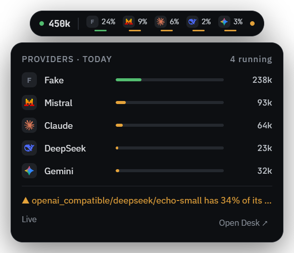
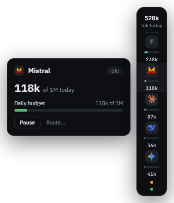

<p align="center">
  
  <h1 align="center">Prompture Desk</h1>
  <p align="center">What your <a href="https://github.com/jhd3197/prompture">Prompture</a> apps are spending, in the tray: usage per provider and project, rate limits and balances — plus live calls, alerts and controls with <a href="https://github.com/jhd3197/prompture-hub">prompture-hub</a>.</p>
</p>

<p align="center">
  
  
</p>

Prompture Desk is a small cross-platform desktop app (Tauri 2: Windows, macOS, Linux). It works in
two modes behind one API:

| | **Prompture on this PC** (no setup) | **prompture-hub** (optional upgrade) |
|---|---|---|
| Needs | Nothing — Desk uses your Prompture, or sets up its own | A running prompture-hub, paired once |
| Sees | Every call your Prompture scripts and apps make on this machine, plus your coding tools (Claude Code, Codex, Kimi Code, …) | Every call routed through the hub — coding tools included — from any machine |
| Shows | Usage per provider and project, rate-limit headroom, coding-tool usage and plan limits, provider balances, calls as they finish | All of that, plus calls while they run, per-key caps, alert rules |
| Controls | Budgets and alerts inside Desk | Pause keys and providers, route overrides, acknowledge alerts |

In local mode Desk starts `prompture companion` for you (a small localhost-only server that ships with
Prompture) and stops it when Desk quits. It uses the Prompture you installed when that one has the
companion (1.13+). Otherwise — no Python, no Prompture, or an older one — Desk sets up its own copy
with the bundled [uv](https://github.com/astral-sh/uv): its own Python and Prompture, kept in Desk's
data folder, never touching yours, and upgraded once a day (Settings › About can switch that to
ask first, or off). That takes about a minute, once. Attribute spend to projects with `PROMPTURE_PROJECT=name` or
`get_tracker().project("name")` in your code.

The companion also counts your **coding tools** from the logs they keep on this PC — Claude Code,
Codex, Kimi Code, Gemini CLI, Qwen Code, OpenCode, Cline, Roo Code and Continue (Cursor and
Antigravity are detected, but keep usage in their online accounts). **Desk › Coding tools** shows
each one's calls, tokens, models and projects for today, the week or the month, which tools are
installed, and which of them Prompture can also run. Only token counts, model names, times and
folder names are read, never prompts or replies. Costs are what the same tokens would cost on the
API — subscriptions don't bill per token, so **tokens** is usually the better metric for them.

Plan limits show under **Limits › Coding plans**. Codex's come from its own logs. Claude Code doesn't
write its 5-hour and weekly windows to disk; Prompture can read them the way Claude Code does, with
Claude Code's own login, but only if you opt in with `PROMPTURE_CLAUDE_PLAN_USAGE=1`. Turn all
coding-tool reading off by running the companion with `--no-coding-tools`.

## The widget

Pick one style in **Desk › Widget**. All three show the same thing — each provider's usage
today against the daily budget you set for it, as a thin strip that turns amber near a limit:

| Style | What it is |
|---|---|
| **Top capsule** (default) | An island at the top-centre of the screen that changes shape with its state: set-up prompt, connecting, live (today's total, each provider's logo and strip), a brief "call finished" note, and idle. Click to expand it into a per-provider panel. |
| **Edge dock** | A floating column off the left or right edge. Hover a provider for its card (budget, rate window, Pause / Resume). Drag it by the total; it snaps to the nearer edge. |
| **Tray chip** | No widget, just the tray icon — drawn with one bar per provider and an amber dot for alerts. (With the other styles the tray shows the app icon, greyed out while offline.) |

**Visibility** decides whether the widget stays out: *Reveal on hover* (default) tucks the capsule
into a sliver at the top edge and the dock into a tab of provider bars at its screen edge, and brings
them out when the pointer reaches them; *Always* keeps them in view.

**Desk itself** is one window, centred on screen: click the tray icon, double-click the widget, or use
**Open Desk** in the capsule. Its sidebar holds a small dashboard — **Overview** (today, this week and
this month, providers against their budgets, projects, recent calls), **Activity**, **Limits** and
**Alerts** — and the settings below it.

Usage can be shown as **price** or **tokens** (flat-rate plans), and the rest is in Settings:
detail level, always on top, hide during full-screen apps, launch at login, light / dark / system,
accent colour, widget opacity, per-provider budgets / order / visibility, the warn threshold,
notifications (hub alerts, paused keys or providers, long calls, failures) with an optional system
sound, and the refresh rate. Provider logos are the LobeHub brand icons, bundled offline.

With **control** access Desk can pause and resume providers (hub-wide) and keys, route a key to
another model or combo, and acknowledge alerts.

## Getting started

Install Desk, open it and choose **Use Prompture on this PC**. That's it — no Python needed.

To add a hub later: **Settings › Connection › Connect a prompture-hub**. Desk finds a hub on
`127.0.0.1:1984` by itself, or takes its address, shows a short code, and you approve it in the
hub's dashboard. Pairing uses the OAuth 2.0 Device Authorization Grant (RFC 8628); the device token
is stored in the OS keychain (never in a file or the webview), can only read hub state — plus change
key and provider settings with control scope — and never calls models. Revoke it in the dashboard
under **Settings › Devices**.

## Develop

Requirements: Node 20+, Rust (stable, via rustup) and the [Tauri prerequisites](https://tauri.app/start/prerequisites/)
for your OS.

```bash
npm install
npm run tauri dev      # fetches uv, runs Vite on 127.0.0.1:28417 and the app
npm run tauri build    # installers for the current OS
```

> **Windows:** if `cargo --version` doesn't match `rustup run stable cargo --version`, another Rust
> install (e.g. Chocolatey's) is ahead of rustup on `PATH`. Put `%USERPROFILE%\.cargo\bin` first.

Design tokens are synced from the hub's dashboard, and provider logos are generated as an offline
subset of the LobeHub icon set:

```bash
npm run sync-tokens    # reads ../prompture-hub/frontend/src/styles.css (or $HUB_STYLES)
npm run gen:icons      # rewrites src/lib/providerIconData.ts from @lobehub/icons-static-svg
npm run fetch:uv       # downloads the pinned uv into src-tauri/binaries/ (runs before dev/build)
```

To try Desk's own Prompture setup against a local checkout (before a release is on PyPI), start Desk
with `PROMPTURE_DESK_PACKAGE=/path/to/prompture`.

### Layout

- `src-tauri/src/hub.rs` — companion API client, pairing, SSE parser (all traffic goes through Rust).
- `src-tauri/src/local.rs` — finds or starts `prompture companion` (local mode), setting up Desk's own Prompture with uv when needed.
- `src-tauri/src/live.rs` — `/v1/live` connection with backoff and `Last-Event-ID` resume.
- `src-tauri/src/store.rs` — settings file + keychain tokens.
- `src-tauri/src/tray.rs` — tray chip rendering (per-provider bars) and menu.
- `src-tauri/src/windows.rs` — Desk's window and the widget window.
- `src-tauri/src/platform.rs` — full-screen detection and the system alert sound (Windows).
- `src/lib/useDesk.ts` — live state, polling, tray summary and notifications.
- `src/lib/model.ts` — per-provider rows (usage vs budget, rate window, running, paused).
- `src/desk.tsx` — Desk's window (dashboard + settings); `src/widget.tsx` — edge dock and top capsule.
- `src/views/Settings.tsx` — the settings pages.
- `src/views/` — onboarding, Now / Headroom / Alerts.

Speaks companion API version 1 (`GET /v1/companion/info`), served by `prompture companion`
(Prompture 1.13+) and by prompture-hub.

## License

MIT
